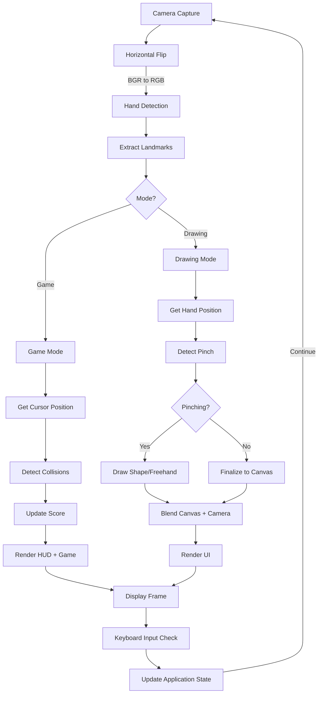

# Hand Gesture Interactive Application

## Overview
A Python-based interactive application that uses computer vision and hand gesture recognition to provide two engaging modes: **Ninja Fruit Game** and **Drawing Mode**. The application leverages MediaPipe for real-time hand pose detection and OpenCV for image processing and visualization.

## Features

### 🎮 Ninja Fruit Game Mode
- **Hand Gesture Control**: Use your hand index finger to cut falling fruits
- **Real-time Scoring**: Earn 100 points per fruit cut
- **Difficulty Levels**: Game difficulty increases with score
- **Lives System**: You have 15 lives; missing fruits costs you one
- **Speed Progression**: Fruits fall faster and spawn more frequently as difficulty increases
- **Visual Feedback**: Color-coded fruits, real-time HUD with Score/Lives/Level/FPS

### 🎨 Drawing Mode
Three drawing modes to unleash creativity:
1. **Line Mode (L)**: Draw straight lines from pinch point to drag endpoint
2. **Circle Mode (O)**: Create circles with pinch as center and drag to set radius
3. **Free Drawing (F)**: Freehand drawing with continuous brush strokes

#### Drawing Features:
- **8 Color Options**: Red, Green, Blue, Yellow, Cyan, Magenta, White, Black
- **Quick Color Selection**: Press R/G/B/Y for instant color switching
- **Persistent Canvas**: All drawings remain permanently until cleared
- **Large Drawing Area**: Minimal UI maximizes canvas space (95% of screen)
- **Clear Canvas**: Press C to clear and start fresh
- **Canvas Blending**: 70% canvas + 30% camera for perfect visibility

## System Requirements
- Python 3.8 or higher
- Webcam/Camera device
- Minimum 4GB RAM
- Windows/macOS/Linux with OpenCV support

## Installation

### Automatic Setup (Windows)
```bash
setup.bat
```
This script will:
1. Create a Python virtual environment
2. Install all required dependencies
3. Configure your environment

### Manual Setup
```bash
# Create virtual environment
python -m venv .venv

# Activate virtual environment
# On Windows:
.venv\Scripts\activate.bat
# On macOS/Linux:
source .venv/bin/activate

# Install dependencies
pip install -r requirements.txt
```

## Dependencies
- **opencv-python** (4.13.0.90): Image processing and visualization
- **mediapipe** (0.10.21): Hand pose detection and landmark extraction
- **numpy** (≥1.24.0): Numerical operations and array handling

## Usage

### Running the Application
```bash
python hand_gesture_interactive_app.py
```

### Main Menu Controls
- **Press 1**: Start Ninja Fruit Game
- **Press 2**: Enter Drawing Mode
- **Press Q**: Quit application

### Game Mode Controls
- **Hand Position**: Move your hand to position the cutting cursor
- **Touch Fruit**: Use your index finger to cut falling fruits
- **Press M**: Return to menu
- **Press Q**: Quit

### Drawing Mode Controls
- **Pinch to Draw**: Pinch thumb + index finger to activate drawing
- **L**: Switch to Line mode
- **O**: Switch to Circle mode
- **F**: Switch to Free drawing mode
- **R/G/B/Y**: Select Red/Green/Blue/Yellow colors
- **C**: Clear the canvas
- **M**: Return to menu
- **Q**: Quit

## Computer Graphics Concepts

### 1. **2D Coordinate Transformation**
The application transforms 3D hand landmarks (normalized coordinates 0-1) to 2D screen pixels:
```
screen_x = landmark.x * image_width
screen_y = landmark.y * image_height
```
This is fundamental in graphics for mapping normalized device coordinates to screen space.

### 2. **Rasterization**
- **Line Rasterization**: OpenCV's `cv2.line()` uses Bresenham's line algorithm to draw anti-aliased lines on pixel grids
- **Circle Rasterization**: `cv2.circle()` uses Midpoint circle algorithm for efficient circular shape drawing
- **Concept**: Converting vector-based geometric shapes into discrete pixel representations

### 3. **Color Space Management**
- **BGR Format**: OpenCV native color space (reverse of RGB for historical reasons)
- **Color Blending**: Alpha blending using `cv2.addWeighted()` for canvas transparency:
  ```
  output = src1 * alpha + src2 * beta + gamma
  ```
- **Concept**: Creating smooth transparency effects through weighted color combination

### 4. **Image Compositing**
- **Layered Rendering**: Camera frame + canvas overlay + UI elements
- **Depth Illusion**: Hand skeleton overlay creates 3D appearance in 2D space
- **Concept**: Combining multiple 2D layers to create complex visual compositions

### 5. **Real-time Rendering Pipeline**
```
Camera Input → Flip/Mirror (Transformation) → Hand Detection → 
Drawing Logic → Canvas Blending (Compositing) → UI Rendering → Display Output
```
This pipeline demonstrates the fundamental graphics rendering cycle: Input → Process → Transform → Composite → Output

### 6. **Geometric Calculations**
- **Distance Formula**: For collision detection and circle radius
  ```
  distance = sqrt((x2-x1)² + (y2-y1)²)
  ```
- **Pinch Detection**: Euclidean distance in normalized space
- **Concept**: Using mathematical geometry for spatial relationship analysis

### 7. **Matrix Operations**
- **Reshaping**: Converting 1D point arrays to 2D contours for polylines
- **Array Broadcasting**: NumPy operations for efficient batch processing
- **Concept**: Leveraging linear algebra for efficient graphics computations

### 8. **Vector Graphics Operations**
- **Polyline Drawing**: Multi-point line segments for smooth trails
- **Shape Composition**: Building complex UI from primitives (rectangles, circles, text)
- **Anti-aliasing**: OpenCV applies anti-aliasing to smooth jagged edges

### 9. **Anti-aliasing & Filtering**
- Applied automatically in cv2.line() and cv2.circle() for smooth visuals
- Reduces aliasing artifacts in rendered shapes

### 10. **View Transformation - Horizontal Flip**
```python
img = cv2.flip(img, 1)  # Flip horizontally for mirror effect
```
Creates natural user experience where hand movements match visual feedback (web-camera mirror effect)

## Workflow and Problem-Solving Approach

### Problem Statement
Develop an interactive hand gesture recognition system that allows users to:
1. Play a game by detecting hand gestures and controlling gameplay
2. Draw geometric shapes and freehand art using hand gestures
3. Provide real-time visual feedback with minimal latency

### Approach

#### Phase 1: Hand Detection Setup
- Integrate MediaPipe Hands solution for real-time hand pose estimation
- Extract 21 hand landmarks per detected hand
- Identify key landmarks: Thumb (4) and Index finger (8)

#### Phase 2: Gesture Recognition
- **Pinch Detection**: Calculate Euclidean distance between thumb and index
  - If distance < 0.05 (normalized) → Pinching state activated
  - Otherwise → Released state
  
#### Phase 3: Game Implementation
- **Fruit Generation**: Random spawn position at top of screen
- **Collision Detection**: Distance-based hit detection between cursor and fruits
- **Score System**: Points awarded for accurate cuts
- **Difficulty Scaling**: Progressive speed increase based on score

#### Phase 4: Drawing System
- **Mode Selection**: Three modes (Line, Circle, Free) with different rendering logic
- **Shape Persistence**: Canvas stored as NumPy array, blended with camera feed
- **Real-time Preview**: Show shape outline during drawing before finalization

### Technical Pipeline



## Application Architecture

### Core Components

#### 1. Hand Detection Module
```python
hands = mp.solutions.Hands(
    static_image_mode=False,
    max_num_hands=1,
    min_detection_confidence=0.7,
    min_tracking_confidence=0.5
)
```
- Uses MediaPipe's pre-trained hand pose model (MobileNetV2 based)
- Returns 21 landmarks with (x, y, z) coordinates in normalized space
- **Landmark Layout**: 
  - 4: Thumb tip (for pinch detection)
  - 8: Index finger tip (primary cursor)
  - Others: Palm, fingers, wrist positions

#### 2. Game Engine (`play_game_mode`)
**Components**:
- **Fruit Management**: List of fruit dictionaries with position and color
- **Collision Detection**: 
  ```python
  distance = sqrt((cursor_x - fruit_x)² + (cursor_y - fruit_y)²)
  if distance < FRUIT_SIZE: score += 100
  ```
- **Difficulty System**:
  ```python
  level = (score / 1000) + 1
  spawn_rate = level * 0.8
  speed[1] = 5 * level / 2  # Fall speed increases
  ```

#### 3. Drawing System (`play_drawing_mode`)
**Canvas Management**:
- NumPy array: `canvas = np.zeros((h, w, 3), uint8)`
- Stores all drawn content persistently
- Blended with camera: `output = 0.3 * camera + 0.7 * canvas`

**Drawing Modes**:
```python
if drawing_shape == "line":
    cv2.line(canvas, start_point, end_point, color, 5)
elif drawing_shape == "circle":
    radius = distance(start_point, end_point)
    cv2.circle(canvas, start_point, radius, color, 5)
elif drawing_shape == "free":
    cv2.line(canvas, prev_point, curr_point, color, 5)
```

#### 4. UI/UX Layer
- **Full-screen Display**: `cv2.WINDOW_FULLSCREEN`
- **Dynamic Text Sizing**: Uses `cv2.getTextSize()` for responsive layout
- **Responsive Panels**: Top and bottom control panels with adaptive positioning
- **Real-time Information**: FPS counter, score, lives, difficulty level

## File Structure

```
Ninja-Fruit-Like-Game-with-hand-gesture-and-opencv/
├── hand_gesture_interactive_app.py    # Main application
├── requirements.txt                    # Python dependencies
├── setup.bat                          # Windows setup script
├── README.md                          # Comprehensive documentation
├── PROBLEM_STATEMENT.md               # Detailed problem & approach
├── VIVA_QUESTIONS.md                  # Interview questions & answers
└── .venv/                             # Virtual environment (after setup)
```

## Troubleshooting

### Camera not detected
- Ensure webcam is connected and not in use by another application
- Check camera permissions in system settings

### Hand detection not working
- Ensure adequate lighting
- Keep hand within camera frame
- Avoid occlusions

### Lines/Circles vanishing
- Make sure to release pinch (thumb + index separation) to finalize shapes
- Shapes are drawn to canvas on pinch release

### Low performance/FPS
- Close other demanding applications
- Reduce video resolution if needed
- Improve lighting conditions

### ImportError: No module named 'mediapipe'
- Run `pip install -r requirements.txt` again
- Ensure virtual environment is activated

## Performance Metrics
- **Frame Processing**: ~30-60 FPS on standard hardware
- **Hand Detection Latency**: ~10-20ms
- **Drawing Responsiveness**: <50ms
- **Game Loop Frequency**: Real-time at monitor refresh rate

## Future Enhancements
- Multi-hand support for collaborative drawing
- Gesture recognition (rock-paper-scissors, thumbs up, etc.)
- Sound effects and game music
- Game leaderboard and statistics
- Custom drawing brushes and patterns
- Hand pose AI trainer mode
- Additional game modes (laser cutting, target practice)
- Save/Export drawings to image files

## License
This project is provided as educational material for teaching Computer Graphics and Human-Computer Interaction concepts.

## Credits
- **MediaPipe**: Hand pose detection framework by Google
- **OpenCV**: Open Computer Vision library
- **NumPy**: Numerical computing library

## Contact & Support
For issues or questions, refer to the VIVA_QUESTIONS.md and PROBLEM_STATEMENT.md files for comprehensive Q&A and technical documentation.  
      </ul>
    <li><a href="#results">Results</a></li>
    <li><a href="#conclusion">Conclusion</a></li>
    <li><a href="#contact">Contact</a></li>
    <li><a href="#acknowledgements">Acknowledgements</a></li>
       
  </ol>
</details>

## About the project

The use of a physical device for human-computer interaction, such as a mouse or keyboard, hinders natural interface since it creates a significant barrier between the user and the machine.  
However, new sorts of HCI solutions have been developed as a result of the rapid growth of technology and software.  
In this project , I have made use of a robust hand and finger tracking system ,which can efficiently track both hand and hand landmarks features , in order to make a fun Ninja fruit-like game.

## Software Requirements:

### Python environment:

* Python 3.9 
* A python IDE , in my case I used [PyCharm](https://www.jetbrains.com/fr-fr/pycharm/).

### Packages:
* [OpenCV](https://opencv.org/course-opencv-for-beginners/#home) : OpenCV is the world's largest and most popular computer vision library . The library is cross-platform and free for use.
* [MediaPipe](https://google.github.io/mediapipe/) : MediaPipe offers cross-platform, customizable ML solutions for live and streaming media. it will help us detect and track hands and handlandmarks features.
* [Numpy](https://numpy.org/) : introducing support for large, multi-dimensional arrays and matrices, as well as a vast set of high-level mathematical functions to manipulate them.

**NB**: All these packages need to be installed properly.

## Software implementation:
### Hand Landmark Model:
For more details check this [Mediapipe hand tracking documentation](https://google.github.io/mediapipe/solutions/hands).
  

Following palm detection over the entire image, the hand landmark model uses regression to accomplish exact keypoint localization of 21 3D hand-knuckle coordinates within the detected hand regions, i.e. direct coordinate prediction.

Concerning the MULTI_HAND_LANDMARKS: 
Collection of detected/tracked hands, where each hand is represented as a list of 21 hand landmarks and each landmark is composed of x, y and z. x and y are normalized to [0.0, 1.0] by the image width and height respectively. z represents the landmark depth with the depth at the wrist being the origin, and the smaller the value the closer the landmark is to the camera. The magnitude of z uses roughly the same scale as x.

### Python implementation:
Now let's get to our code:  
Let's begin with importing the required packages

 ```py
import cv2 
import time               # useful for calculating the FPS rate
import random             # for spawning "fruits" at random positions and random colours
import mediapipe as mp    # for hand detection and tracking
import math               # for various mathematical calculations
import numpy as np
 ``` 
Now lets get our objects :
 ```py
mp_drawing = mp.solutions.drawing_utils
mp_drawing_styles = mp.solutions.drawing_styles
mp_hands = mp.solutions.hands

hands = mp_hands.Hands(False,1,0.7,0.5)
 ``` 
The  `hands = mp_hands.Hands(False,1,0.7,0.5)` line is used to initialize a MediaPipe Hand object.  
Its arguments are as follows:
* **static_image_mode:** Whether to treat the input images as a batch of staticand possibly unrelated images, or a video stream. 
* **max_num_hands:** Maximum number of hands to detect. 
* **min_detection_confidence:** Minimum confidence value ([0.0, 1.0]) for hand detection to be considered successful. 
* **min_tracking_confidence:** Minimum confidence value ([0.0, 1.0]) for the hand landmarks to be considered tracked successfully. 
  
now , the below variables will be needed to calcumate the FPS rate.

 ```py
curr_Frame = 0
prev_Frame = 0
delta_time = 0
 ``` 
Let's create and assign our gameplay variables:
 ```py
next_Time_to_Spawn = 0   # variable to compute the time to spawn a "fruit".
Speed = [0,5]            # Speed vector along the x , y axis
Fruit_Size = 30          # radius of the circle representing the fruit
Spawn_Rate = 1           # Spawning rate of "fruits" (Per second) initially at 1 fruit /s
Score = 0                # Score initially at 0
Lives = 15               # number of Lives initially at 15
Difficulty_level= 1      # Difficulty level which will increase according to Score, initially at 1
game_Over=False          # Whether the game is lost , initially false ofc.
 ``` 
 
  ```py
 slash = np.array([[]],np.int32)   # a numpy array of arrays in order to keep track of the index finger positions in order to draw a curve representing the slash
slash_Color=(255,255,255)         # initial slash color : white
slash_length= 19                  # number of points to keep track of

w=h=0       # to store width and height of the frame
Fruits=[]   # the list to keep track of the "fruits" on screen
 ``` 
 Now lets create our functions :
 lets begin with fruit spawning function:
 
   ```py
 def Spawn_Fruits():
    fruit = {}
    random_x = random.randint(15,600)                                                   # x position of the fruit randomly generated
    random_color = (random.randint(0,255),random.randint(0,255),random.randint(0,255))  # Colour of the fruit randomly generated
    #cv2.circle(img,(random_x,440),Fruit_Size,random_color,-1)                           # uncomment to test the of spawning the fruit as a circle on random x position and on a 440 y position
    fruit["Color"] = random_color                                                       
    fruit["Curr_position"]=[random_x,440]
    fruit["Next_position"] = [0,0]
    Fruits.append(fruit)
 ``` 
* Each fruit data is represented with a dictionary with the following keys : `"Color"` , `"Curr_position"` ,`"Next_position"` .
* In order to keep track of each fruit after its creation it must be appended to the Fruit list 
* Each fruit is generated at position of a 440 value on the y axis and a random position between 15 and 600 on the x axis
* Each fruit is generated with a random colour of value between 0 and 255 on each of the rgb channels.

Now let's move our "fruits":

```py
def Fruit_Movement(Fruits , speed):
    global Lives

    for fruit in Fruits:
        if (fruit["Curr_position"][1]) < 20 or (fruit["Curr_position"][0]) > 650 :
            Lives = Lives - 1
            #print(Lives)
            #print("removed ", fruit)
            Fruits.remove(fruit)

        cv2.circle(img,tuple(fruit["Curr_position"]),Fruit_Size,fruit["Color"],-1)
        fruit["Next_position"][0]= fruit["Curr_position"][0] + speed[0] 
        fruit["Next_position"][1]= fruit["Curr_position"][1] - speed[1] 

        fruit["Curr_position"]=fruit["Next_position"]
 ``` 
* For each fruit in our list : we check the position of the fruit :if its y position is below 20 then we decrement the Lives variable.  
* Each fruit's next position is equals to it's previous position + speed.

Lets get a function to calculate a distance between two 2d points :

```py
def distance(a , b):
    x1 = a[0]
    y1 = a[1]

    x2 = b[0]
    y2 = b[1]

    d =math.sqrt(pow(x1 -x2,2)+pow(y1-y2,2))
    return int(d)
  ``` 
Now let's get to the main part of the code:
  
```py  
cap = cv2.VideoCapture(0)           # we set our pc webcam as our input
while(cap.isOpened()):              # while the webcam is opened
    success , img = cap.read()      # capture images
    if not success:
        print("skipping frame")
        continue
    h, w, c = img.shape             # get the dimensions of our image 
    
    img = cv2.cvtColor(cv2.flip(img, 1), cv2.COLOR_BGR2RGB)  # we flip the img bc it's initially mirrored and convert it from BGR to RGB in order to process it correctly with mediapipe
    img.flags.writeable = False     # To improve performance, optionally mark the image as not writeable to pass by reference.
    results = hands.process(img)    # launch the detection and tracking process on our img and store the results in "results"
    img = cv2.cvtColor(img, cv2.COLOR_RGB2BGR) # reconvert the img to its initial BGR Color space
    
    if results.multi_hand_landmarks:                          #if a hand is detected
        for hand_landmarks in results.multi_hand_landmarks:
            mp_drawing.draw_landmarks(                        # draw the landmarks 
                img,
                hand_landmarks,
                mp_hands.HAND_CONNECTIONS,
                mp_drawing_styles.get_default_hand_landmarks_style(),
                mp_drawing_styles.get_default_hand_connections_style())

            #**************************************************************************************
            for id , lm in enumerate(hand_landmarks.landmark): 
                if id == 8:                                       # id = 8 corresponds with the tip of the index finger
                    index_pos=(int(lm.x * w) ,int(lm.y * h))      # store the position of the index figer along the x and y axis
                                                                  # each hand is represented as a list of 21 hand landmarks and each landmark is composed of x, y and z. x and y are normalized to [0.0, 1.0] by the image width and height respectively. 
                                                                  #so in order to get the correct position we mutiply the x and y by the width and height of our image
                    cv2.circle(img,index_pos,18,slash_Color,-1)   
                    #slash=np.delete(slash,0)
                    slash=np.append(slash,index_pos)              # apped the position of the index in a numpy array

                    while len(slash) >= slash_length:             # keep the length of the slash array constant
                        slash = np.delete(slash , len(slash) -slash_length , 0)

                    for fruit in Fruits:                              
                        d= distance(index_pos,fruit["Curr_position"])           #calculate the distance between the index finger tip and each of the fruits
                        cv2.putText(img,str(d),fruit["Curr_position"],cv2.FONT_HERSHEY_SIMPLEX,2,(0,0,0),2,3)
                        if(d < Fruit_Size):                                     # if distance < size of the fruit the the fruit is "cut"
                            Score= Score + 100                                  # the score increments by 100
                            slash_Color = fruit["Color"]                        # the slash takes the color of the last fruit "cut"
                            Fruits.remove(fruit)                                # remove the fruit that was cut from the list of fruits


            #***********************************************************************************************************
  
      if Score % 1000 ==0 and Score != 0:        #each time the score is a multiple of 1000 (1000 , 2000 etc ..)
        Difficulty_level = (Score / 1000) + 1    # Difficulty level increments by 1 for every 1000 score
        Difficulty_level= int(Difficulty_level)  # convert it to integer value
        print(Difficulty_level)
        Spawn_Rate =  Difficulty_level * 4/5     # Spawn rate increases by 80 %
        Speed[0] = Speed[0] * Difficulty_level   
        Speed[1] = int(5 * Difficulty_level /2) # speed increases by 250 %
        print(Speed)

#*****************************************************************************
#*****************************************************************************

    if(Lives<=0):  # if u run out of lives the game is over
        game_Over=True

    slash=slash.reshape((-1,1,2))                     # reshape the slash array in order to draw a polyline a visualize the slash
    cv2.polylines(img,[slash],False,slash_Color,15,0) # draw the slash

    curr_Frame = time.time()
    delta_Time = curr_Frame - prev_Frame
    FPS = int(1/delta_Time)                 #calculating the fps
    cv2.putText(img,"FPS : " +str(FPS),(int(w*0.82),50),cv2.FONT_HERSHEY_SIMPLEX,0.6,(0,250,0),2)                 #printing the fps on the screen
    cv2.putText(img,"Score: "+str(Score),(int(w*0.35),90),cv2.FONT_HERSHEY_SIMPLEX,1,(255,0,0),5)                 #printing the score on the screen
    cv2.putText(img,"Level: "+str(Difficulty_level),(int(w*0.01),90),cv2.FONT_HERSHEY_SIMPLEX,1,(255,0,150),5)    #printing the Level on the screen
    cv2.putText(img,"Lives remaining : " + str(Lives), (200, 50), cv2.FONT_HERSHEY_SIMPLEX, 0.8, (0, 0, 255), 2)  #printing remaining lives on the screen


    prev_Frame = curr_Frame

    #***********************************************************
    if not (game_Over):                               # if the game is still not over then keep spawning and moving the fruits
        if  (time.time() > next_Time_to_Spawn):       
            Spawn_Fruits()
            next_Time_to_Spawn = time.time() + (1 / Spawn_Rate)

        Fruit_Movement(Fruits,Speed)


    else:                                     # if game is over then print it and clear all the fruits
        cv2.putText(img, "GAME OVER", (int(w * 0.1), int(h * 0.6)), cv2.FONT_HERSHEY_SIMPLEX, 3, (0, 0, 255), 3)
        Fruits.clear()
        
    cv2.imshow("img", img)                    #display the resulting image

    if cv2.waitKey(5) & 0xFF == ord("q"):     # the "q" button to quit
        break

cap.release()                                 # release the webcam
cv2.destroyAllWindows()

  ``` 
  ## Results:
  
  
  
  ## Conclusion:
In this project, we successfullty detected and tracked a hand and its landmarks ,using the mediapipe module, and were able to extract data in order to create an interactive hand gesture mini-game with basic gameplay features such as  score , difficulty level and losing conditions.
  
  ### Contact:
* Mail : mohamedamine.benabdeljelil@insat.u-carthage.tn -- mohamedaminebenjalil@yahoo.fr
* Linked-in profile: https://www.linkedin.com/in/mohamed-amine-ben-abdeljelil-86a41a1a9/

### Acknowledgements:
* Google developers for making the [Mediapipe hand tracking module](https://google.github.io/mediapipe/solutions/hands)
* OpenCV team for making the awesome [Opencv Library](https://opencv.org/)
* [NumPy Team](https://numpy.org/gallery/team.html) for making the [Numpy Library](https://numpy.org/about/)
  
